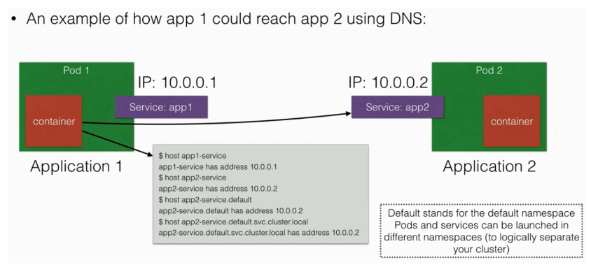
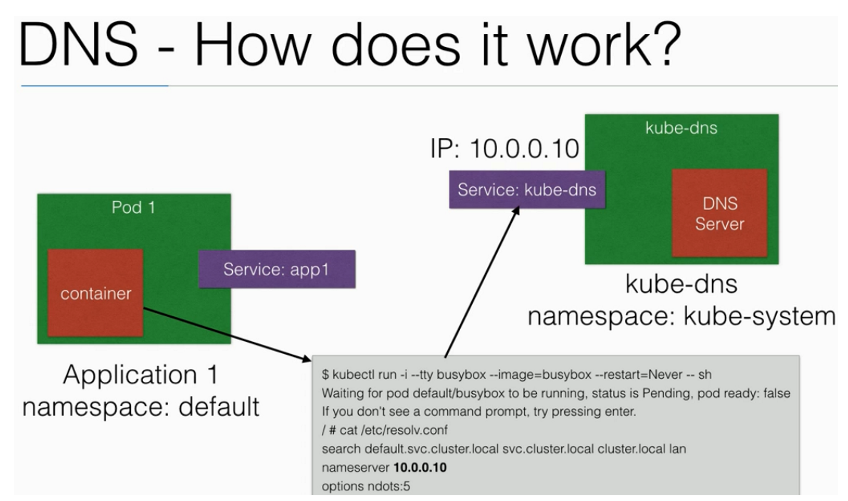

# Services Discovery

từ phiên bản Kubernetes 1.3, DNS là một built-in service được launch tự động sử dụng addon manager

  * Addons được lưu tại /etc/kubernetes/addons trên master node
    - DNS service có thể được sử dụng bên trong các pods để tìm các services khác đang chạy trong cùng cluster

* Nhiều containers trong một pod không cần DNS service, chúng contact với nhau trực tiếp
  - Container trong cùng một pods có thể kết nối với nhau sử dụng localhost:port
  - Muốn DNS hoạt động, một pod cần phải được có Service definition

