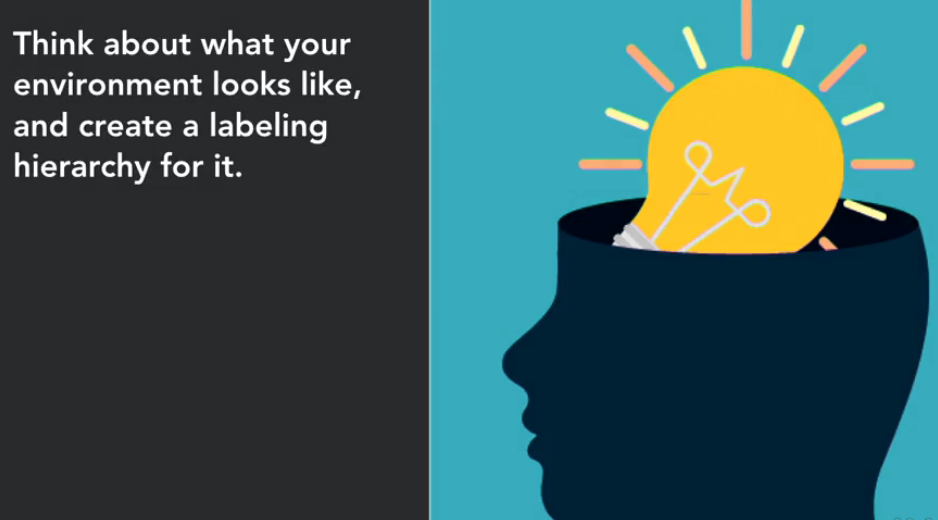
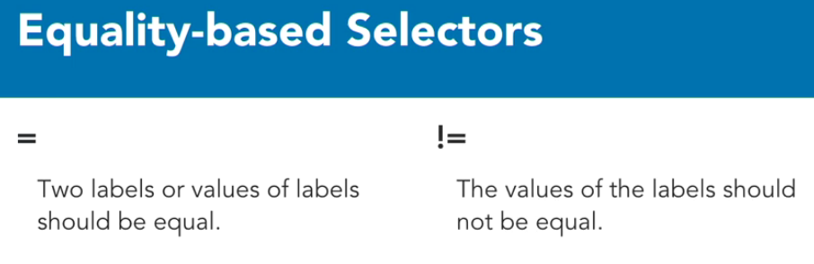
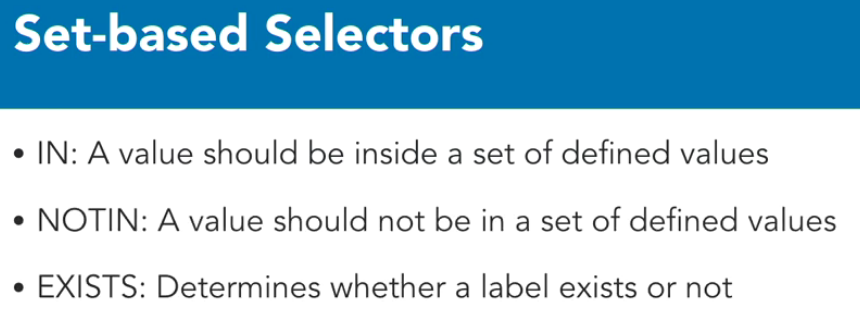
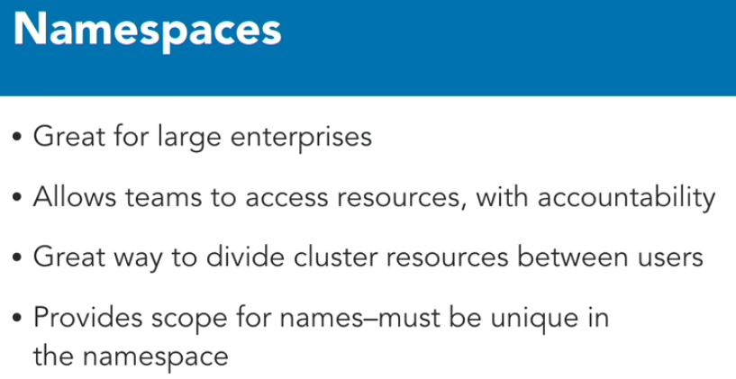

labels, selectors, and namespaces. These constructs allow us to agitate and organize our applications so that when we have a lot of them, Kubernetes operators still understand what's going on holistically. Labels are key value pairs that are attached to objects like pods, services, and deployments. Labels are for us, the users of Kubernetes, to identify attributes for objects. Typically, labels are used to organize clusters in some meaningful way. They can be added at deployment time, or later on and changed at any time.

Label keys are unique per object. Here are some examples of labels we might use. We might have a release label that has stable or canary deploys. We could have environment labels that specify the environment, such as dev, qa, production, et cetera, or perhaps tier labels to signify that something is a front end or a back end tier. As you can tell, labels are very specific to your use case, and they are built for users, so think about what your environment looks like, and how you want to organize your applications, and then get your label maker out.

By themselves, labels aren't really that powerful. But when you add selectors, you introduce a very powerful feature. With labels and selectors, you can identify a specific set of objects. There are two kinds of selectors, equality-based and set-based. Equality-based selectors include the equals and not equals, where the equals represents equality, where two labels or values of labels should be equal. Not equal represents inequality. This means that the values of the labels should not be equal.

Next, we have set-based selectors that include IN, NOTIN, and EXISTS operators. The IN operator specifies that the value should be in a set of defined values. The NOTIN operators specified that the value should not be in a set of defined values. And finally, the EXISTS operator is used to determine whether a label exists or not. Labels and label selectors are typically used with a kubectl command to list and filter objects. We'll look at examples of how to use labels and selectors later on in the demo section of the course.

And finally, we have namespaces.

# Labels, selectors và namespaces.

Label, selector và namespace giúp ta tổ chức và sắp xếp applications -> khi ta quản lý nhiều applications, ta vẫn có thể hiểu rõ tổng quan hệ thống.

##### Label:
Label là key-value pair được gắn với object(pod, service và deployments). Label giúp ta định danh được tính chất của object. Thông thường, labels được sử dụng để tổ chức các cluster in some meaningful way. Chúng có thể được thêm vào at deployment time, hoặc thêm vào sau đó và có thể được thay đổi bất kỳ lúc nào
 - Label keys là unique per object.
 - Ví dụ về label:
   - "release": "stable", "release": "canvary", ...
   - "environment": "dev", "environment": "qa", ...
   - "tier": "frontend", "tier": "backend", ...

labels are very specific to your use case, and they are built for users, so think about what your environment looks like, and how you want to organize your applications, and then get your label maker out.

##### Selector:
Selector kết hợp với label tạo thành 1 tính năng toàn tăng. Với label kết hợp vơis selector ta có thể định danh 1 specific set of objects.
* Có 2 loại selectors:
 - equality-based:
  
 - set-based
  

##### namespaces:
namespace là một feature của kubernetes cho phép ta có multiple virtual clusters trên cùng một physical cluster.

Namespaces rất tốt cho việc sử dụng cho hệ thống lớn có rất nhiều user và team khác nhau. Ví dụ khi mà ta muốn give access to different team nhưng ta vẫn muốn kiểm soát xem ai được quyền access vào cái gì trong môi trường kubernetes
- 
- Ví dụ:
  - Ta có triển khai cho 1 big e-commerce company sẽ có namespace cho catalog team, card team và order status team để họ có thể chạy app khác nhau trên cùng một hệ thống.
- Ta có thể phân chia tài nguyên cluster sử dụng resource quotas.
