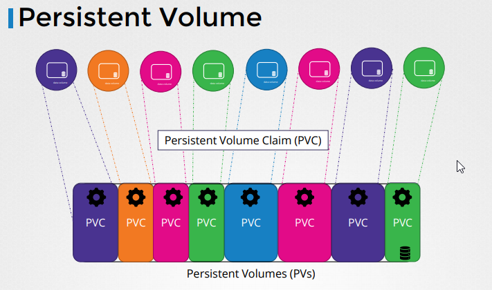
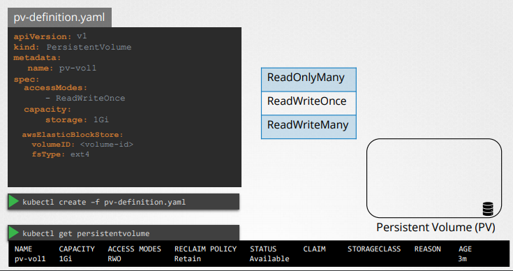

# Persistent Volume

Now when you have a large environment with a lot of users deploying a lot of pods the users would have to configure storage every time for each pod. 

Whatever storage solution is used the users who deploys the pods would have to configure that on all pod definition files in his own environment every time it changes to be made the user would have to make them on all of his pods.

-> Instead you would like to manage storage more centrally. You would like it to be configured in a way that an administrator can create a large pool of storage and then have users carve out pieces from it has required. 

-> That is where persistent volumes can help us.

A persistent volume is a cluster wide pool of storage volumes configured by an administrator to be used by users deploying applications on the Cluster.
The users can now select storage from this pool using ** persistent volume claims** let us now create a persistent volume.

### Example config persistent volume

