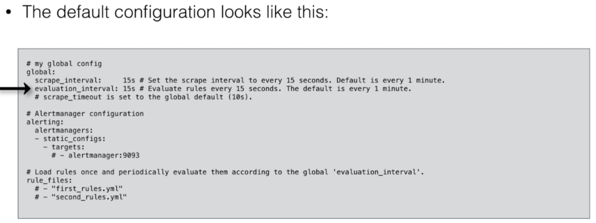
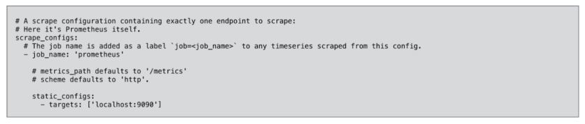

# Prometheus Configuration
*   Configuration is stored in the Prometheus configuration file, in yaml format
    *   Configuration file can be changed and applied, without having to restart Prometheus
        *   A reload can be done by executin kill -SIGHUP <pid> (just reload configuration)

*   You can also pass parameters (flags) at **startup time** to ./prometheus
    *   Those parameters cannot be changed without restarting Prometheus
*   Configuration file is passed using the flag --config file

---

* To scrape metrics, you need to add configuration to the prometheus config file
  * For example, to scrape metrics from prometheus itself, the following code block is added by default

