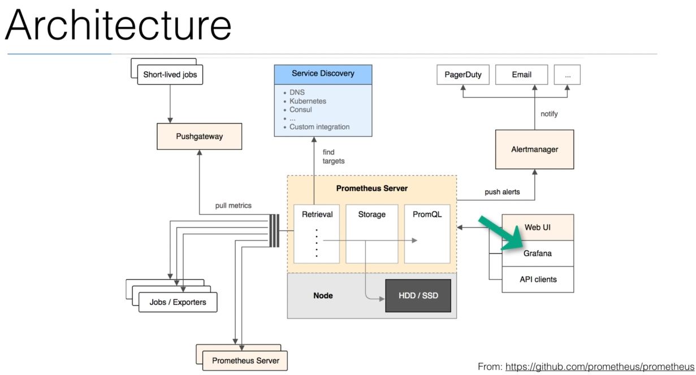

# How Prometheus Works behind the scenes

OK, but first of all, we need to understand that in targets, whether it may be some application or it can be some system, metrics do not appear magically.

No doubt permit is mostly uses a pull approach to pull metrics.

But to make your application ready to work with Prometheus, you have to add the instrumentation that produces those metrics.

And for this instrumentation, there are a number of custom libraries available out there.

So for the time being.
Just understand that after adding instrumentation to your application code, your applications become ready to get scraped from Prometheus.
OK.

Now, **assuming that you have your applications ready with you,** what will be the first phase in this architecture 

##### Service Discovery - Discover targets
The first step of Prometheus would be to identify where the target resides.
This is the time where service discovery comes into play in conjunction with service discovery for meters.
Get to know where its targets are.

##### Pull metrics
After knowing its targets.
The next step would be to pull the metrics from the target Prometheus.
Fetch the metrics by sending an extra HTTP request all script.
If the application can be pulled directly, then take this route.

Or if the application does not allow direct pulling and does only push, then this route(route to Pushgateway) will be taken at will push metrics in the gateway and eventually Prometheus will pull them from push gateway.

##### Store into local storage
After the push or pull.
Scraped records are past and are stored into some local storage **in its time series database**.

Please note that this gripping thing happens regularly after the specified interval of time time like after 15 seconds, 20 seconds or whatever you have specified.

##### Data visualization
Now, once the metrics are stored in two time series database, these metrics can be fetch either by Prometheus  using its from Google Goody's or you can also generate the rich graphs or dashboard from this metrics by integrating Grafana or any other thought by the API clients.
This is how a small glitch free, maundering works.

##### Alertmanager (if get some kind of error) 
But now comes a situation better target being monitored does not match with the rules that we have defined in such situation.

What will happen in that case?

That alerts are pushed into the alert manager and alert manager after grouping those them into notifications

like email, pager duties, lack, etc..

Knowing the severity of alert, a human can be called to take a look into it and the lifecycle ends there.