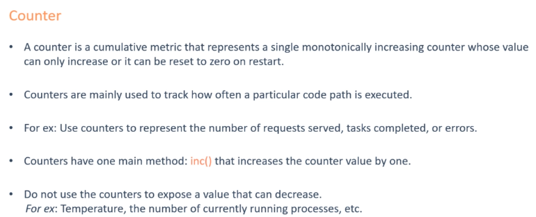
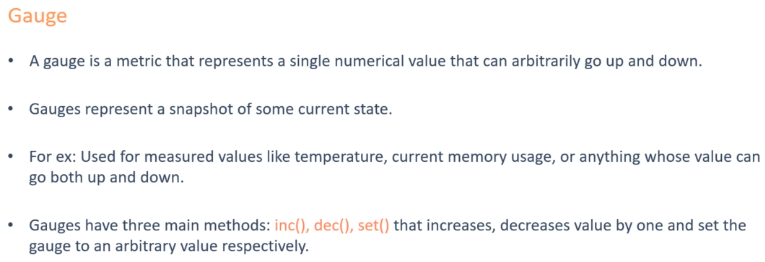
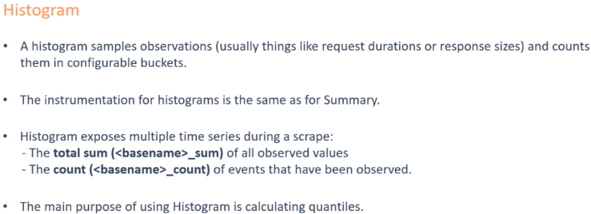
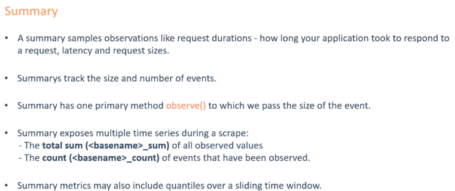

#

### Four types of metrics
* Counter: A value only go up (Ex: Visit to a website)

* Gauge: Single numeric value that can go up and down (CPU load, temperature, ...)

* Historgram: Samples observations (Ex: request duration or response sizes). These observations get counted into buckets. Include (_count and _sum)
  * Main purpose is calculating quantiles

* Summary: Similar to histogram, a summary sample observations (Ex: request durations or responsize)
* Summary also provides a total counts of observations and a sum of all observation values, it calculates configurable quantiles over a slideing time window
  * Example: You need **2  counters** for calculating the **latency**
  1. **total request** **(_count)**
  2. **total latency** of those **requests** **(_sum)**
-> Take the rate() and divide = average latency

