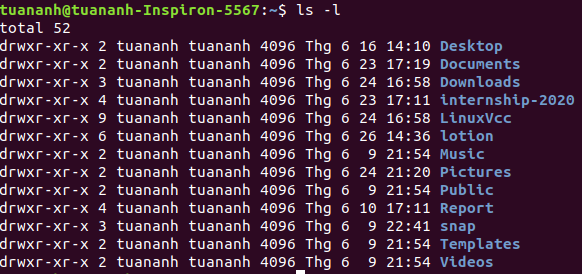

# Chmod

## Syntax: `chmod *mode *file`

### Các option

Gồm 3 option cơ bản :

1. `-r` : áp dụng với tất cả các file thuộc vào đường dẫn
2. `-f` : áp dụng ngay với trường hợp lỗi
3. `-v` : hiện thị log các thực thi

Danh sách các mode 

---

### Xem quyền đối với file:

- Sử dụng syntax `ls -l` để xem danh sách quyền thực thi đối với các file tại pwd ( position of working directory)
    - Ví dụ :

        

    - Được chia làm 3 trường riêng biệt ( ở cột đầu tiên sẽ thể hiện tên file )
        - Trường 1 ( 3 dòng sau cột file type) : User
        - Trường 2 ( 3 dòng tiếp theo ): Group ( mà User thuộc vào )
        - Trường 3 (3 dòng tiếp theo ) : Others ( Các User khác )

    ### Ý nghĩa:

    1. r : read - Đọc
    2. w : write - Chỉnh sửa
    3. x : execute - Thực thi 

---

### Cách set mode cho từng trường hợp:

1. Phân quyền cho file: 
    - Syntax : `chmod *mode *file`
2. Phân quyền cho đường dẫn
    - Syntax : `chmode *mode *đường dẫn`
3. Phân quyền cho các file đệ quy thuộc đường dẫn :
    - Syntax : `chmod -R *đường dẫn`
4. Ngoài ra có thể sử dụng:
    - `chmod *u/g/o +r/+w/+x *file` khi muốn thay đổi quyền cho 1 file
- Tài liệu tham khảo:

    [https://quantrimang.com/phan-quyen-truy-cap-file-bang-lenh-chmod-59672#mcetoc_1di4t882a6](https://quantrimang.com/phan-quyen-truy-cap-file-bang-lenh-chmod-59672#mcetoc_1di4t882a6)

    [https://marcyes.com/2018/0208-a-simple-way-to-remember-linux-permissions/](https://marcyes.com/2018/0208-a-simple-way-to-remember-linux-permissions/)

    [https://vinasupport.com/chmod-la-gi-huong-dan-su-dung-lenh-chmod-tren-linux-unix/](https://vinasupport.com/chmod-la-gi-huong-dan-su-dung-lenh-chmod-tren-linux-unix/)
